# 草原から森へ・グレーボックスQA

対象: `../../meadow-to-forest-greybox.html`  
検証日: 2026-08-09  
基準: `docs/3d-scene-brief-meadow-to-forest.md`、`docs/meadow-to-forest-greybox-shot-plan.md`  
最優先画像: `artwork/preproduction/meadow-to-forest-storyboard-nihonga-simplified-v1.png`

このQAは構図、空間連続性、ルート同期に加え、承認済みの柔らかい日本画・水彩方向へ進めるかを仮レンダーで判断するためのもの。6コマは「仮レンダー表示ON・植生ON」、橋手前3点は「構造表示・植生OFF」で同一HTML版から撮影した。

## 6コマ横並び比較

| s / 場面 | 承認済みスケッチ該当コマ | 同一版の実装画像 | 合格条件判定 | 未達点 |
|---|---|---|---|---|
| 0.00 花の草原 | 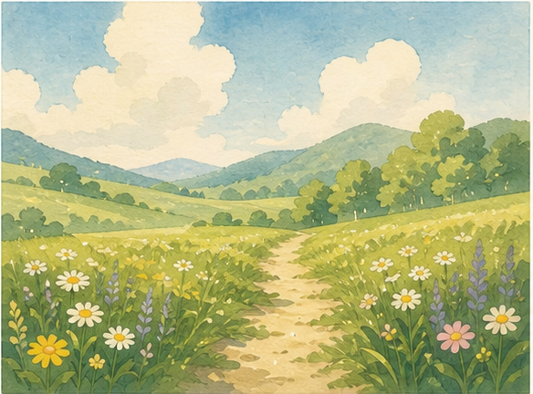 | 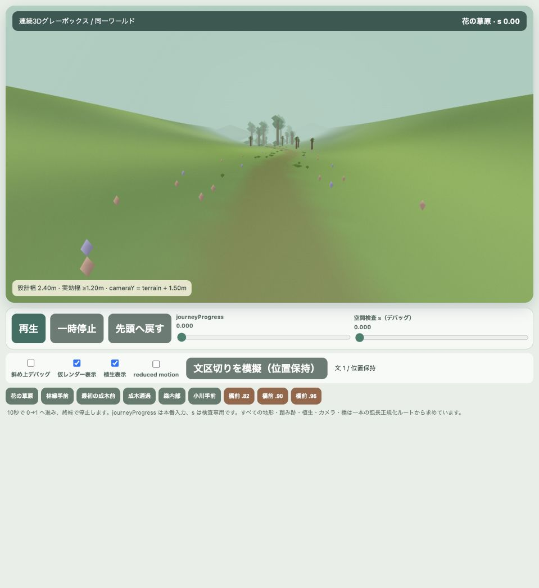 | **合格**。広い空が半分以上、近景高木なし、少数の花、遠い林縁と山を識別可能。 | 花・草の大きな群と雲は仮形状未満。品質版で補う。 |
| 0.20 林縁手前 | 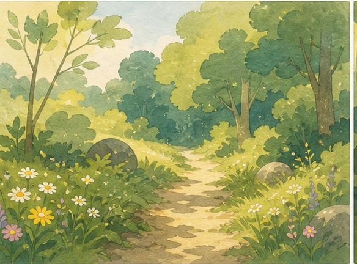 | 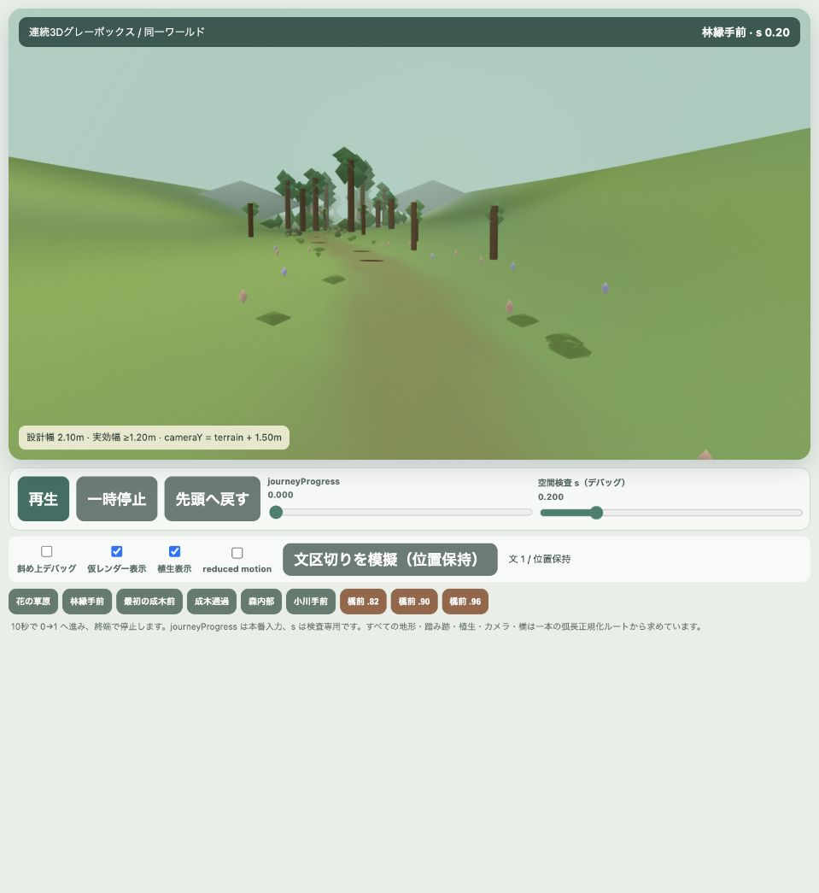 | **合格**。太い近景木を置かず、若木が中景へ入り、草原の続きに林縁が迫る。 | スケッチの大岩と片側へ偏った低木の量感は弱い。 |
| 0.40 最初の成木前 | 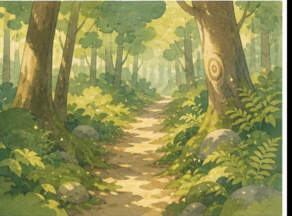 | 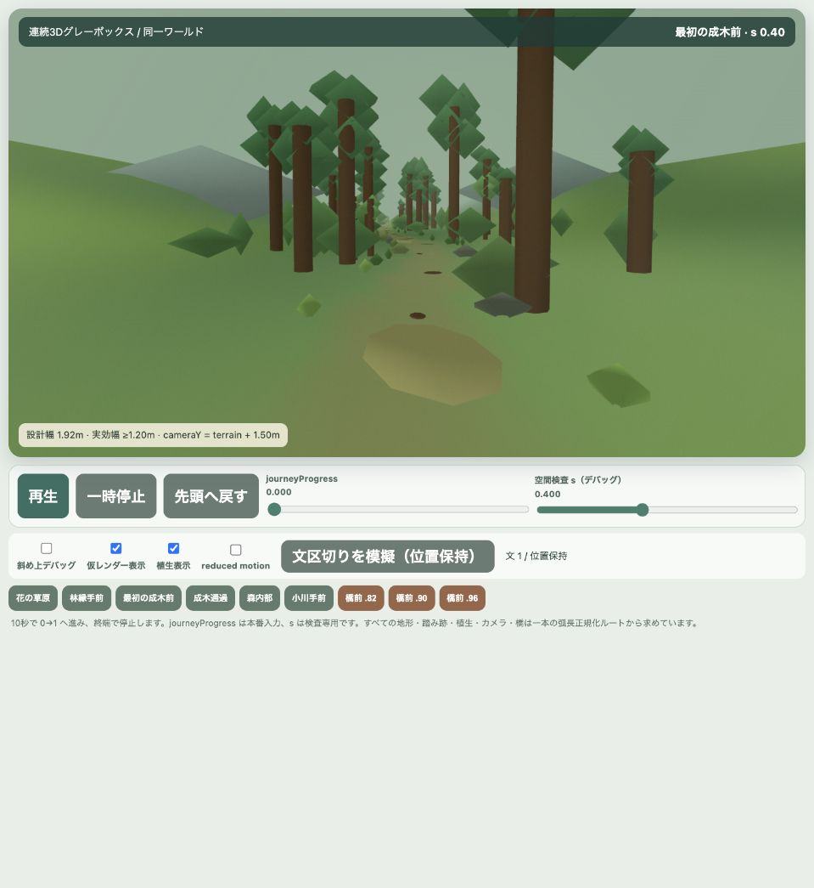 | **未達**。配置上は通過対象2本と片側の岩・低木塊があるが、画像では幹列と菱形葉塊が支配し、スケッチの有機的な入口に見えない。 | 樹冠形状、幹陰影、林床材質をs=.75の描画検証後に反映する。 |
| 0.55 成木通過 | 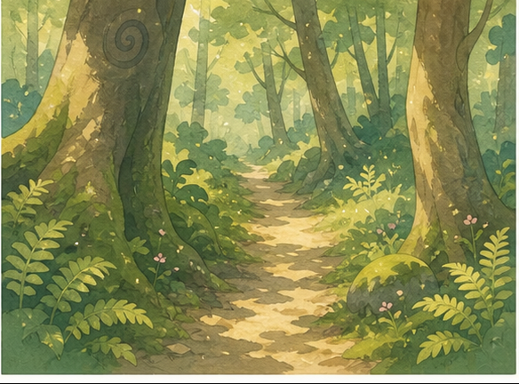 | 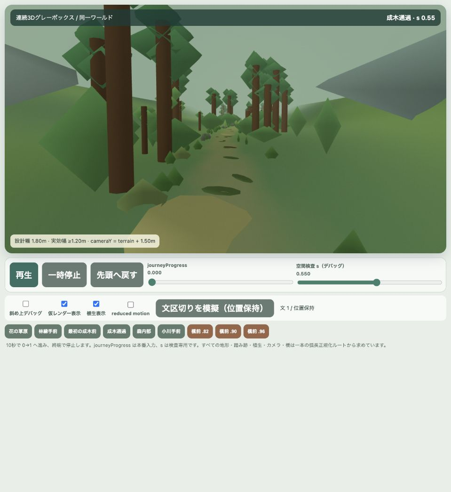 | **合格**。s=.4から同じ空間を進み、左右非対称の成木間を暗転・切替なしで通過する。 | 根の形と幹表面は未制作。樹冠は識別用の交差塊。 |
| 0.75 森内部 | 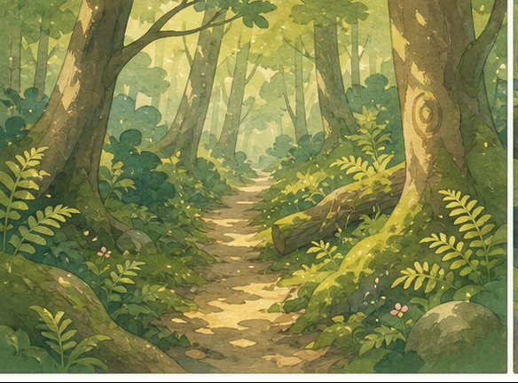 | 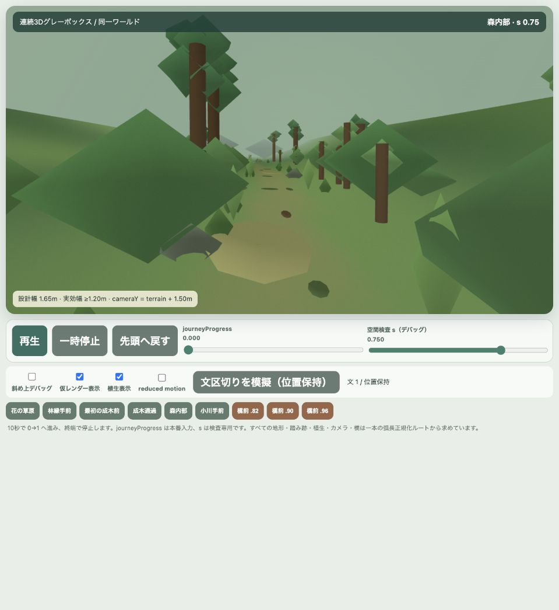 | **未達**。論理上5層を配置したが、出力は巨大な菱形葉塊と道沿いの低ポリ列に見え、苔・落葉・シダ、霧、木漏れ日、紙目を画像から判別できない。 | 本節を最初の仮レンダー承認地点として作り直す。 |
| 1.00 小川手前 | 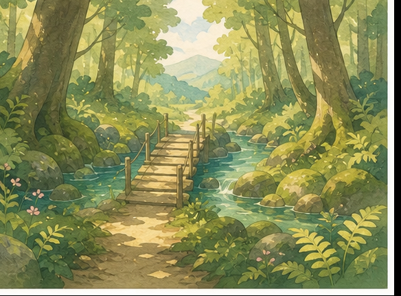 | 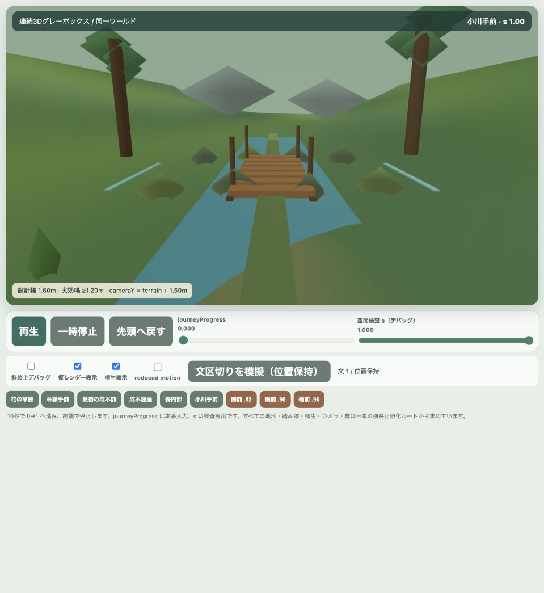 | **未達**。橋板は読めるが、水は青い平面、山は菱形、対岸路は垂直板状に見え、完成イメージ判断に使えない。 | s=.75の描画方式承認後、水・岸・遠山・対岸路を同方式で再構成する。 |

上記はグレーボックスの構図要件に対する自己評価であり、品質版完成の意味ではない。親レビューで画面目標に不足すると判断された場合は、品質版へ進まず配置を修正する。

## 橋手前デバッグ

| s | 画像 | 設計幅 | 判定 |
|---:|---|---:|---|
| .82 | 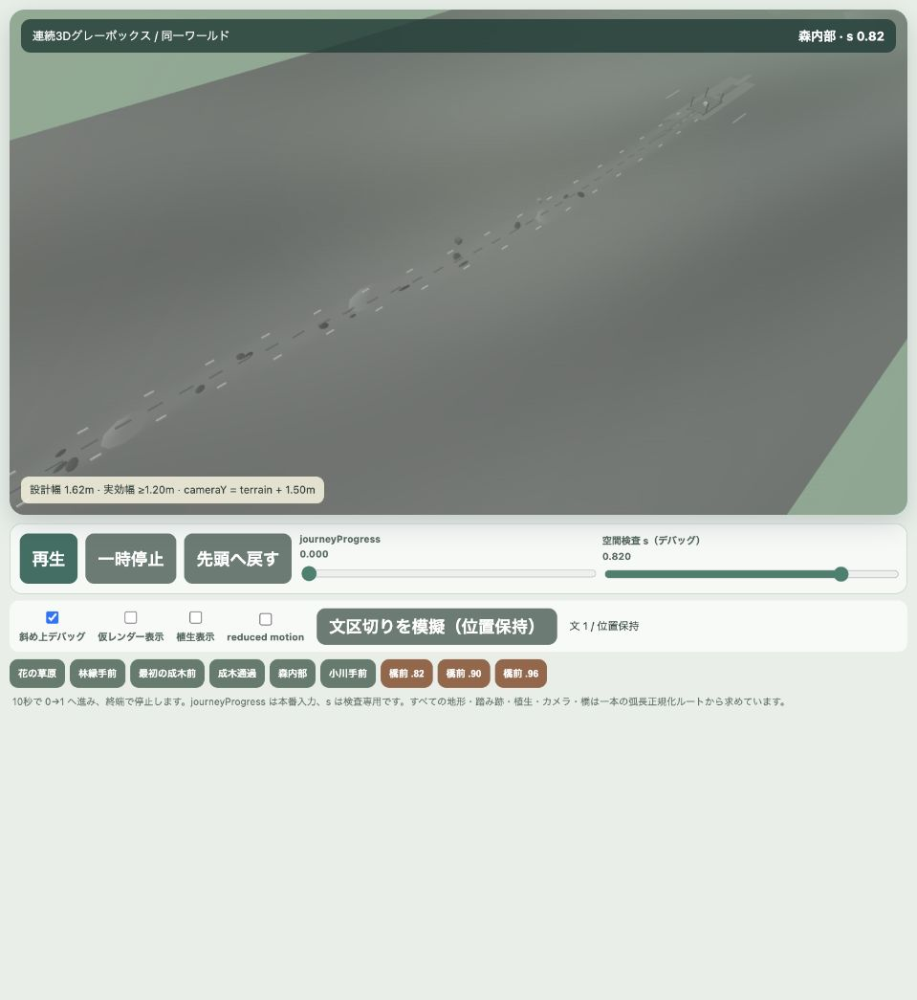 | 1.62m | 植生OFF。中心線、左右境界、カメラ、先読み点、橋中心を追跡可能。 |
| .90 | 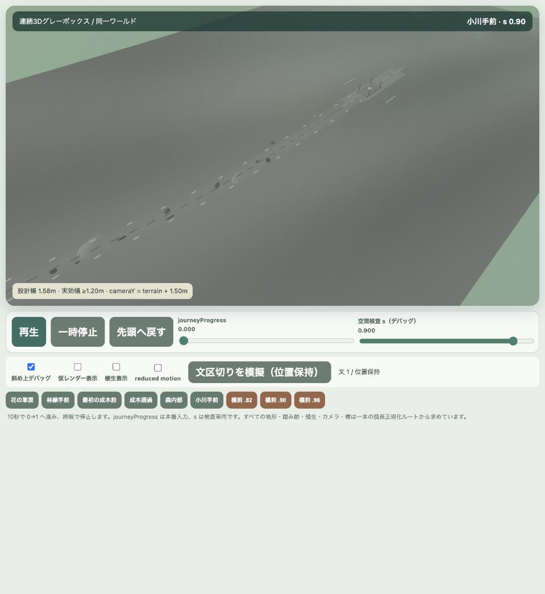 | 1.58m | 同上。急な漏斗状の縮幅なし。 |
| .96 | 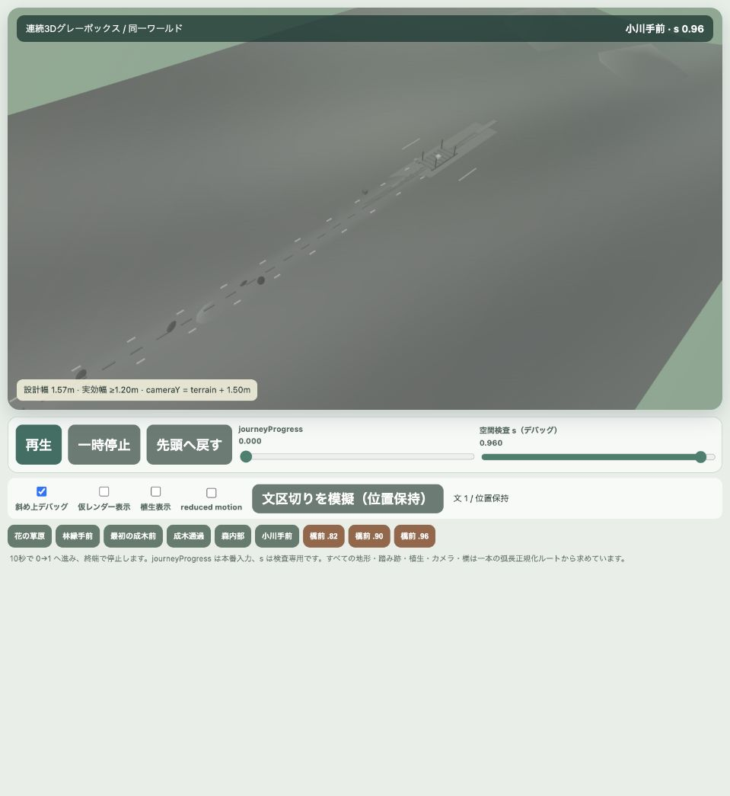 | 1.57m | 同上。橋中心とルート終端の向きを確認可能。 |

表示色:

- 赤: 共通中心線
- 黄: `trailWidth(s)`の左右境界
- 青: 基準カメラ
- 桃: 先読み点
- 水色: 橋中心

デバッグ用の橋前ボタンは、斜め上ビューを有効化し植生を自動的にOFFにする。通常6コマでは植生をONにしている。

## 技術検証

- 一本道は一本のCatmull–Romスプラインを高密度LUTで弧長正規化したもの。
- カメラ、先読み、trail mask、道幅、植生基準、橋中心・向きは同じルート評価関数を使用。
- 地形の道色はルート最近傍点と符号付き距離相当から生成し、独立した道中心式を持たない。
- 道幅は2.40mから1.56〜1.62mへ滑らかに縮小する。
- 苔・落ち葉色面は固定シードで非周期に置き、横断帯と中央一列を避けた。
- 基準カメラ高は`terrainHeight(cameraX,cameraZ)+1.50m`。注視点も先読み位置の地形高を使う。
- `journeyProgress`は10秒で0から1へ進み、終端で停止する。
- 文区切り操作は旅座標を変更しない。
- reduced motionでは歩行揺れを無効化する。
- 外部CDNやネットワークへ依存せず、単体HTMLとして動作する。

## 現在の仮レンダー層

- 地面: 草原から林床まで連続する固定シードの頂点色。低周波の緑・土色むら、道中心の苔・落葉色面、オフセンターの木漏れ日面。
- 樹皮: 暖かな茶色を基調に、ワールド座標由来の低周波色むらと柔らかい明暗。
- 葉・低木・草本: 層ごとに黄緑、翡翠、深緑を分け、近景を濃く遠景を霧色へ寄せる。
- 岩: 灰緑と苔色を分け、林床の土・葉とは異なる明度にする。
- 水: 青緑の面に、流れ方向の少数の明るい筆致を重ねる。
- 画面処理: 黒輪郭を使わない連続陰影、距離霧、微細な固定粒状感、薄い紙面風の光色オーバーレイ。
- 表示切替: 「仮レンダー表示」をOFFにすると彩度を抑えた構造確認表示になる。橋前検査ボタンは構造表示へ自動切替する。

すべて固定シードまたはワールド座標から決まる手続き表現で、スクラブしても模様と材質は移動・再配置されない。

## 画像差分から決める次のレンダリング設計

現出力は、コード上の色変化が小さく、菱形プリミティブと単色面が支配している。旧試作・承認スケッチとの差は次の実装で画面上へ明示する。

| 項目 | 旧試作・承認スケッチで見えるもの | 現出力の問題 | s=.75検証で実装するもの | 画像上の合格条件 |
|---|---|---|---|---|
| 照明 | 幹の丸み、樹冠塊の柔らかな明暗、斜めの木漏れ日 | 面ごとの明暗差が弱く平板 | 半球光＋斜め主光相当の連続Lambert、弱い上向きリム。地面にオフセンターの大きな淡色面 | 幹の明暗面が最低3段階に見え、円柱と判別できる |
| 法線 | 樹冠が丸い複数塊、岩が苔むした量塊 | 葉が二錐体の菱形 | 葉塊を低分割の丸い楕円体へ置換。各木3〜5塊を高さ・径・奥行き違いで交差 | 単一菱形の輪郭がなく、一樹が複数の丸い色面として読める |
| 材質 | 樹皮、葉、苔、落葉、岩、水で筆致と色域が異なる | tintのみで表面差がない | `materialKind`ごとのワールド空間手続き模様。樹皮は縦筋、葉は大きな斑、地面は低周波洗い、岩は苔斑、水は細い流れ | 静止画を拡大せずに地面・幹・葉・岩を色と模様で区別できる |
| テクスチャ座標 | 模様が物体へ定着し、カメラ移動で滑らない | 目視できる模様がない | グレーボックスではUV atlasを作らず、ワールド座標の三軸投影／高さ軸を使用。固定シードで再現 | 同じsへ戻ったとき模様が同じ位置にある |
| 輪郭 | 黒線なし、色境界が柔らかい | 鋭いポリゴン輪郭 | 黒アウトラインを使わず、丸い形状、距離霧、弱いリム、画面オーバーレイで境界をなじませる | 巨大な硬い菱形輪郭が画面を分断しない |
| ポスト処理 | 紙目、透明水彩の粒、遠景の空気色 | 紙目と粒が画像で見えない | 画面全体へ一度だけSVG turbulence紙目を重ね、フラグメント粒状感を少し強める。霧開始を近づける | 通常スクリーンショットで薄い紙粒が見え、遠景が青緑へ抜ける |
| 林床 | 苔、土、落葉、シダ、岩、倒木の重なり | 単色地面と抽象小物 | 道外に苔面、道内に落葉面、道端に扇状シダ、苔岩、大形倒木を重ねる | 高木を隠しても林床だけで森内部と分かる |

### s=.75単独ゲート

現在の中間提出: 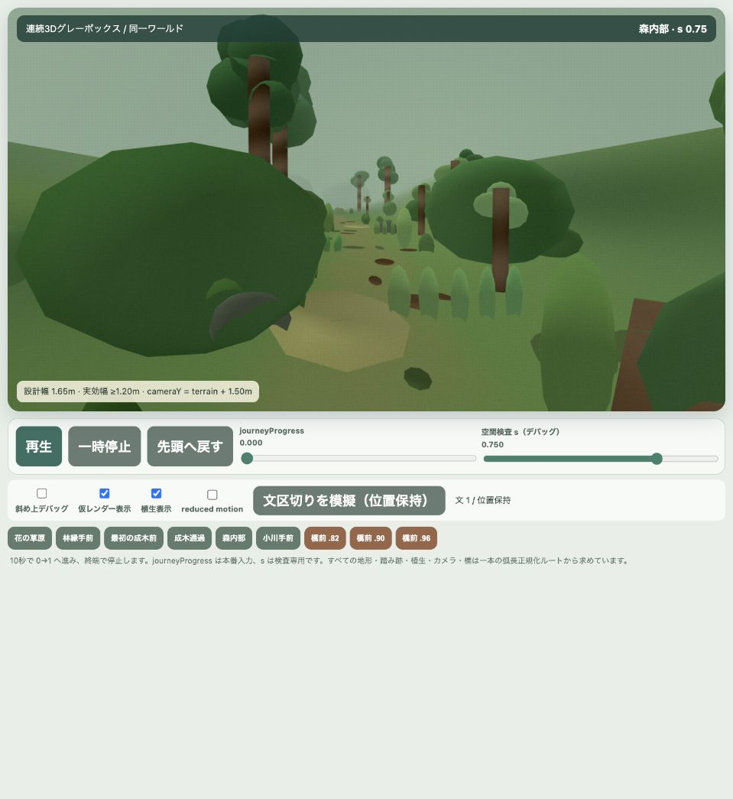

次の5項目が一枚の画像で同時に読めるまで、他の5コマを再撮影しない。

1. 菱形でない、丸く重なる複数樹冠塊。
2. 立体陰影と縦方向の色むらがある幹。
3. 苔、落葉、扇状シダ、岩、倒木が区別できる林床。
4. 奥が青緑に抜ける霧と、中央から外れた木漏れ日。
5. 画面全体へ薄く一度だけ掛かった紙目。

中間自己評価:

- 葉塊: 二錐体の菱形から、低分割の丸い楕円体3〜5塊へ置換済み。
- 幹: 円柱法線による連続陰影と縦方向の手続き色むらを確認可能。
- 林床: 黄緑の苔面、茶色の落葉面、扇状に並ぶシダ、大岩、左側の倒木を別色・別形状で表示。
- 奥行き: 遠景が青緑へ抜ける距離霧と、道の中央から外した淡い木漏れ日面を表示。
- 紙目: 画面全体に固定粒状オーバーレイを一度だけ適用し、スクリーンショット上でも確認可能。

この自己評価をもって他5コマへはまだ展開しない。親画像レビューで本ゲートが通った場合だけ、同じ材質・形状方式を他コマへ適用して全画像を撮り直す。

## レンダラー基盤の再検討

### 現状の構造的な不合格理由

`interim-render-s075.png`は前版より丸み、霧、粒状感が増えたが、承認スケッチの森としては不合格である。

- 空が画面の約半分を占め、林冠が頭上で部分的につながっていない。
- 低木が巨大な球状塊となり、左右の壁として画面を塞いでいる。
- 高木が「棒状の幹＋球状の葉」で、根元、主枝、枝先、複数樹冠塊の生態的な関係を持たない。
- シダ、落葉、苔、倒木が画面上で小さく、5層の林床として判読できない。
- trail maskが中央の広い明色面を維持し、苔・落葉・草が戻る獣道に見えない。
- Raw WebGLの全物体を即時描画する構造では、階層モデル、材質差分、影、半透明、検査表示を増やすほど実装が密結合になる。

したがって、現在のプリミティブ数や色を調整し続けても、必要な品質へ安定して到達しない。次工程の前にレンダラー基盤を選び直す。

### 選択肢A: 現WebGLミニレンダラーを拡張

| 観点 | 内容 |
|---|---|
| 必要機能 | 階層Transform、枝付き樹木ジェネレーター、Instancing、透過順序、shadow map、offscreen framebuffer、深度／法線テクスチャ、材質ごとのshader variant、UV／triplanar mapping、trail mask用地形shader、ポスト処理チェーン、scene culling、デバッグlayerをすべて自前実装する。 |
| 樹木・植生 | 幹を複数円錐台で分節し、枝を親子行列で接続する仕組みが必要。樹冠、低木、シダを別geometryとし、現行の汎用`blob`依存を廃止する。 |
| 地形・道 | 地形shaderへルート最近傍データを渡す方法、低周波trail mask、苔・落葉復帰、法線再計算、岸の掘り下げを自作する。 |
| 材質・光 | WebGL 1のuniform／attribute制約内で、樹皮、葉、林床、岩、水を別shaderまたは分岐で管理。shadow framebufferとPCF相当の柔らかい影を自作する。 |
| ポスト処理 | 色境界のにじみ、距離霧、紙目、color grading用に複数passとframebuffer管理を自作する。 |
| 検査 | 構造表示と仮レンダー表示のGL state、shader、描画順を別々に維持する必要がある。 |
| 想定工数 | s=.75の承認用1画面まで約8〜15実働日。6コマの安定化まで追加5〜10日。低レベル基盤の不具合調査を含み、幅が大きい。 |
| 品質到達性 | 原理上は可能。ただし描画基盤そのものの開発が主作業になり、構図・植生・画風の反復が遅い。現在の短い単体HTMLを維持するほど品質と保守性が下がる。 |
| 単体HTML | 外部依存なしの一枚を維持できる。ただしコード量が大きくなり、shaderとデータをHTML内で管理するためレビュー性が悪化する。 |
| 主なリスク | 自作機能の検証に時間を使い、承認スケッチへ近づく画面調整が後回しになる。WebGL 1制約と複雑なstate管理により、見た目の回帰が増える。 |

### 選択肢B: Three.js等のシーングラフ／PBR基盤へ移行

ここでいうPBR基盤は写実化を意味しない。Three.jsのscene graph、geometry、lighting、shadow、render target、loader、material管理を土台として利用し、その上で簡略日本画・水彩調へ抑える。

| 観点 | 内容 |
|---|---|
| 必要機能 | Three.jsの`Scene`、`Group`、`InstancedMesh`、`BufferGeometry`、`MeshStandardMaterial`／`MeshToonMaterial`、shadow map、fog、render target、postprocessingを利用する。共通ルート・弧長LUT・terrainHeightは現在の技術契約を移植する。 |
| 樹木・植生 | 一本の木を根元、幹節、主枝、枝先樹冠の`Group`として作り、3成木・2若木の生成規則を持つ。低木、扇状シダ、苔岩、倒木を別geometry／instanced groupとして画面上の層を直接調整する。 |
| 地形・道 | 高分割terrain geometryに共通ルート由来の属性またはdata textureを渡し、shader patchでtrail mask、forest blend、苔・落葉復帰を同じ地表へ合成する。小川は地形を掘り、岸と水面を別meshで接続する。 |
| 材質・光 | 樹皮・葉・林床・岩・水を個別materialとして管理し、CanvasTextureの固定シード水彩面、toon ramp、低roughness差、大きな木漏れ日shadowを組み合わせる。写真PBRや強い鏡面は使わない。 |
| ポスト処理 | EffectComposer相当でcolor grading、薄いedge wash、紙目を一度だけ適用する。霧とtone mappingはscene単位で調整できる。 |
| 検査 | layer／visibilityで植生、地形、デバッグ線を切り替え、同じscene graphから構造表示と仮レンダー表示を作れる。 |
| 想定工数 | 基盤移植とs=.75グレーボックス2〜4日、仮材質・光・林床を含む承認候補まで追加3〜6日。s=.75承認後の残り5コマ展開は追加3〜6日。 |
| 品質到達性 | 高い。階層樹木、複数植生層、影、霧、材質、ポスト処理を構図調整と並行して反復できる。承認スケッチの「大きな色面」「枝先の樹冠塊」「湿った林床」を直接作りやすい。 |
| 単体HTML | 開発時はHTML＋ローカルThree.js module＋scene moduleに分ける。提出時にesbuild等でThree.jsとscene codeを一つの通常HTMLへbundleでき、ネットワーク不要で開ける。JSを同梱したフォルダ版も可能。 |
| 主なリスク | bundleサイズ増加、ライブラリversion固定、shader patchの追従が必要。ただし今回の品質優先・iPad負荷を先に制限しない方針では許容できる。 |

### 比較まとめ

| 評価軸 | A: Raw WebGL拡張 | B: Three.js基盤 |
|---|---|---|
| 共通ルート契約の維持 | 可能 | 可能 |
| 階層的な樹木 | 大量の基盤実装が必要 | scene graphで直接表現可能 |
| 5層の森の反復速度 | 低い | 高い |
| 柔らかい影・霧・材質差 | 自作負担が大きい | 標準機能＋shader調整で可能 |
| 水彩ポスト処理 | framebufferから自作 | render target／composerを利用可能 |
| s=.75品質到達の確度 | 低〜中 | 高 |
| ネットワーク不要 | 可能 | vendoring／bundleで可能 |
| 最終提出を通常HTML一枚にする | 可能 | build工程を通せば可能 |
| 長期保守 | 低い | 中〜高 |

### 推奨

**選択肢B: Three.js基盤へ移行する。**

理由は、今回のボトルネックがルート計算ではなく、階層樹木、植生層、地表合成、影、霧、材質、ポスト処理を画面を見ながら反復する能力にあるため。Raw WebGLを拡張するとThree.jsの一部を再実装する作業になり、品質到達前の技術基盤へ工数が偏る。

推奨する次の承認手順:

1. 現HTMLを比較資料として凍結し、品質版へ継ぎ足さない。
2. Three.jsをローカルへ固定し、ネットワーク不要の開発用サンプルを別ファイルで作る。
3. 現実装から共通スプライン、弧長LUT、`trailWidth(s)`、`terrainHeight`、進捗UI、デバッグ契約だけを移植する。
4. s=.75周辺だけを約25〜35mの空間として作り、階層樹木2〜3種、若木、低木、シダ、苔岩、倒木、林床shaderを検証する。
5. 承認スケッチ下中央とs=.75出力を横並びにし、樹冠、空の抜け、5層、獣道、光、霧、紙目を画像判定する。
6. s=.75承認後にのみ、全長ルートと他5コマを同じscene graphへ展開する。
7. 提出時に依存をbundleした通常HTMLを生成し、オフライン起動を確認する。

Three.js移行後も、写真テクスチャ、写実PBR、強い鏡面、黒アウトライン、全ステージ汎用化は行わない。最初の目標はs=.75一枚の構図・材質承認である。

## 旧試作から再実装した長所

- 暖色の土・樹皮、青緑の霧、黄緑の林床という色調
- 林床を単色にせず、低周波の地色変化と苔・土・落ち葉の色面を重ねる考え方
- 高木、若木、低木、草本、岩の大小差で近景・中景・遠景を作る構成
- 距離霧で遠景の彩度とコントラストを落とす空気遠近
- 固定シードで再現可能かつ非対称な植生配置

旧試作の独立したカメラ曲線、道テクスチャ、固定カメラ高、ループ処理は再利用していない。

## 品質版へ持ち越す項目

- スケッチ相当の水彩テクスチャ、紙目、柔らかな光斑
- 幹の傾き、根、枝分かれ、専用樹冠形状
- シダ、低木、苔岩、倒木の専用モデル
- 小川の岸形状、水面、橋板ディテール、対岸の道と明るい抜け
- 森内部の林床密度と木漏れ日

意図的に未制作の最終素材:

- 高解像度の手描き地面テクスチャとtrail mask
- 樹種別の樹皮・樹冠・枝・根モデルと専用テクスチャ
- 日本画の岩絵具、水彩の輪郭にじみ、紙目の最終シェーダー
- シダ、草花、苔岩、落ち葉、倒木の完成モデル／アトラス
- 水面反射、岸の湿り、泡・流れ、完成版の橋材
- 品質版の木漏れ日、光粒、風揺れ、地域別のカラーグレーディング

ゲーム本体統合、全地域展開、品質版素材制作は未着手。
